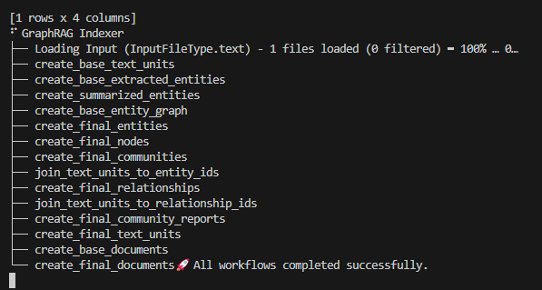

# Graphrag for paper reading

This is a simple tool to help you read papers more efficiently.

## Installation

```bash
git clone https://github.com/hibana2077/Rag_compare.git
cd Rag_compare
```

## Usage

```bash
sudo docker-compose up -d --build
```

Then open your browser and visit `http://localhost:80`.

## Demo





## License

[MIT](./LICENSE)